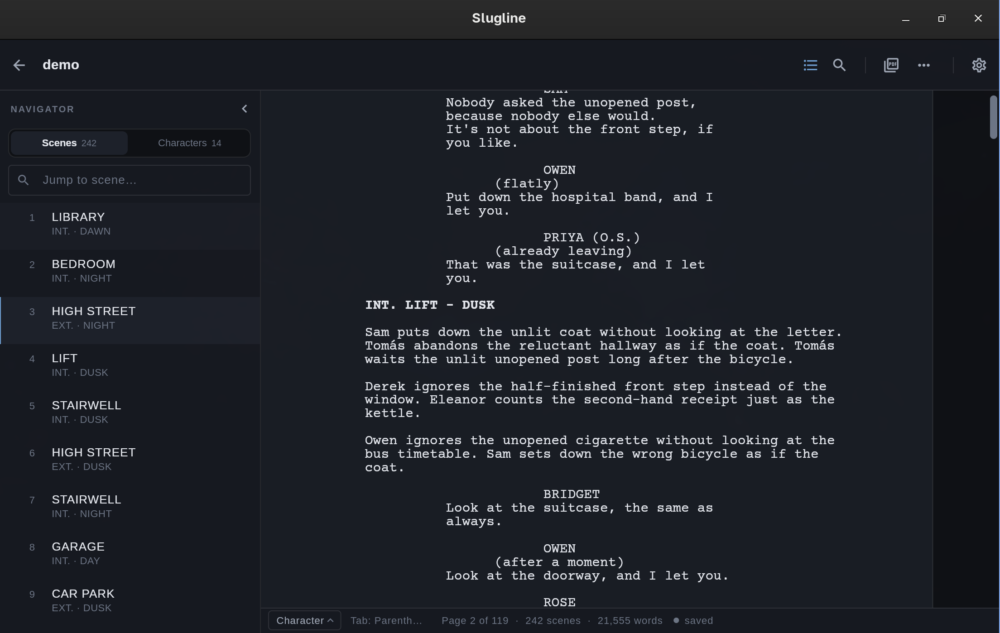
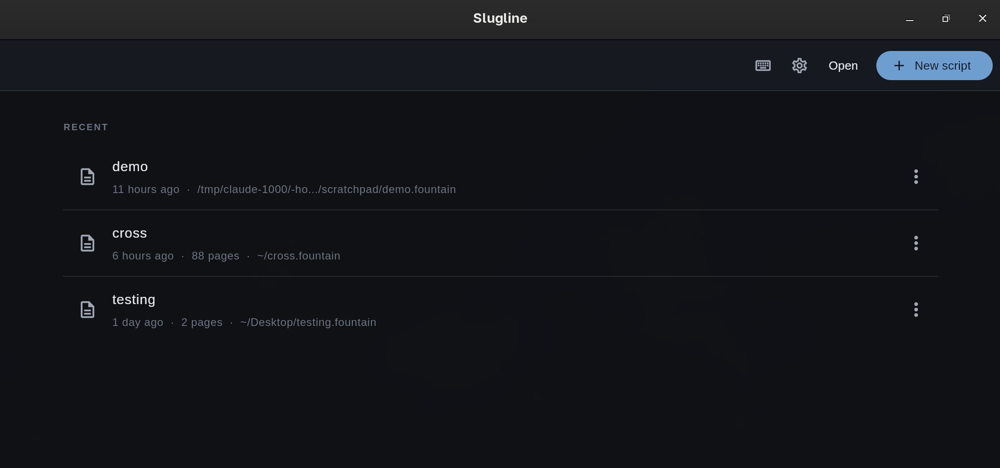
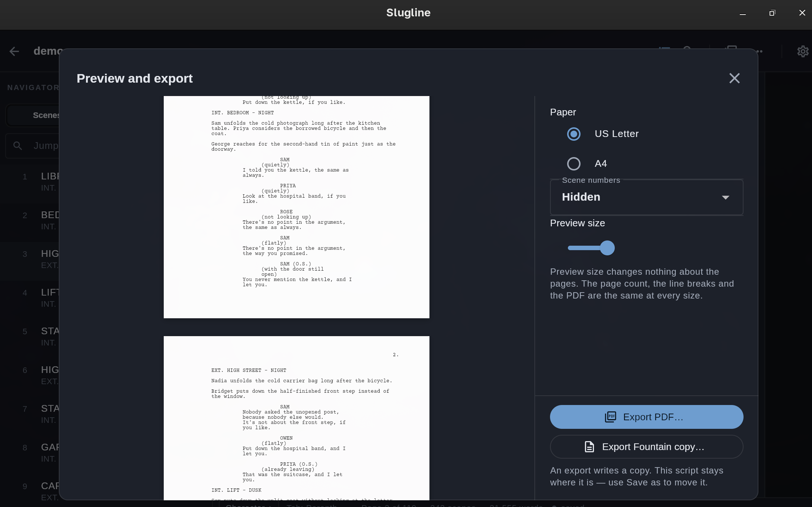

<h1 align="center">Slugline</h1>

<p align="center">
  <strong>A fast, keyboard-driven screenplay editor for Linux.</strong><br />
  Write in plain Fountain. Export submission-quality PDFs.
</p>

<p align="center">
  
  
  
</p>

---

<p align="center">
  
  <br/>
  <em>The editor, with autocomplete, scene navigator, and live spell-check.</em>
</p>

<p align="center">
  
  <br/>
  <em>Work on multiple projects and keep track of all of them.</em>
</p>

<p align="center">
  
  <br/>
  <em>Exported PDF, typeset in Courier Prime to the inch — submission ready.</em>
</p>

---

## What is this?

Slugline is a desktop screenplay editor for writers who want a tool that stays
out of the way. You write in **[Fountain][fountain]** — plain text you can read
and edit anywhere — and Slugline gives you a clean editing surface, a live
page-count, and PDFs that match what a production office expects.

It does **not** need an account, an internet connection, or a subscription. It
never phones home. Your scripts live on your disk as `.fountain` files, and they
always will.

## Features

- **Fluid Fountain editing** — type scene headings, character cues, dialogue,
  transitions and more without reaching for the mouse. Slugline recognises
  Fountain syntax as you type and keeps the formatting invisible.
- **Authored character case** — `@McCLANE` stays `McCLANE` in the editor,
  preview, PDF and continued speech cues. Ordinary cues and scene headings
  still display in capitals. Deliberately lowercase or mixed-case names need
  Fountain's `@`; typing them or selecting Character never silently changes
  the stored spelling to uppercase. Authored extensions such as
  `@MARY (on radio)` retain their case through Save and reopen too.
- **Keyboard-first** — every action has a shortcut. The command palette
  (<kbd>Ctrl</kbd>+<kbd>K</kbd>) lets you reach anything by
  name. See `docs/KEYMAP.md` for the full map.
- **Live autocomplete** — character names and scene headings are suggested from
  what you've already written.
- **Omit and restore** — use the command palette to omit an exact selection or
  a whole scene into a restorable Fountain boneyard. Each command is one Undo
  step; omitted text stays out of preview and PDF and survives Save/reopen.
  Crash recovery preserves saved omissions and later edits. Restore refuses
  changed context, including whitespace, or damaged records while keeping the text.
- **Outline navigator** — nested sections, synopses and scenes in source order,
  with jumps to every outline block and character cue. Scene rows show actual
  output start pages and occupied length in eighth-pages; pending pagination
  is never replaced with an editor-row estimate.
- **Find & replace** — quick search and replace designed specifically for text
  and Fountain formatting.
- **Spell-check** — checks against your system's Hunspell dictionaries as you
  type. Underlines mistakes; never changes your text.
- **Real-time pagination** — the page count is always current, built from the
  same engine that produces the PDF. Six lines to the inch, exactly.
- **PDF export** — deterministic, submission-quality output in Courier Prime.
  Same script, same bytes, every time. Title page included. US Letter and A4
  both supported.
- **Fountain export** — a clean, canonical copy of your script. Great for sharing
  or checking into version control.
- **FDX interchange** — import screenplay content into a new Fountain script,
  or export an editable FDX copy for collaborators. Conversion warnings are
  shown before proceeding; production revision and page-layout fidelity is not
  promised.
- **Managed script library** — portable project folders with display names, pins,
  previous versions, archive/restore, page counts, and quick search.
- **Crash recovery** — if the editor quits unexpectedly, your unsaved work is
  waiting for you the next time you open that script.
- **External-change detection** — if something else writes your file while it's
  open, Slugline asks before overwriting anything.
- **Title page editor** — fill in title, author, contact, and notes; the PDF
  prints it on its own sheet, unnumbered.

## Install

> [!IMPORTANT]
> The first public release targets **x86_64 Linux only**. Slugline has primarily
> been tested on Arch Linux; reports from other current desktop distributions
> are welcome.

Download published builds from the
**[latest GitHub Release](https://github.com/phagmaier/slugline/releases/latest)**.
`SHA256SUMS` on that page covers both release artifacts.

### AppImage

Download `Slugline-<version>-x86_64.AppImage`, then:

```sh
chmod +x Slugline-*-x86_64.AppImage
./Slugline-*-x86_64.AppImage
```

The AppImage is self-contained and does not install files. Keep it wherever you
keep applications. On systems where AppImage/FUSE mounting is unavailable, it
can still be unpacked with `--appimage-extract`.

### Release tarball

Download `slugline-<version>-linux-x86_64.tar.gz` and `SHA256SUMS` from the same
release, then extract and install for your user:

```sh
sha256sum --ignore-missing -c SHA256SUMS
tar -xzf slugline-*-linux-x86_64.tar.gz
cd slugline-*-linux-x86_64
./install.sh
```

The default prefix is `~/.local`; pass an absolute prefix such as `/usr/local`
to `install.sh` if you are deliberately managing a shared installation. The
included `uninstall.sh` accepts the same prefix. It removes only packaged files
and never removes scripts, preferences, backups, or recovery data.

### Building from source

After installing the [source build requirements](#source-build-requirements),
run these commands from the checkout root. No `sudo` is needed for installation:

```sh
(cd app && flutter pub get --enforce-lockfile)
./tools/package.sh
./tools/smoke_test_tarball.sh
version="$(./tools/release_version.sh)"
"./dist/slugline-$version-linux-x86_64/install.sh"
export PATH="$HOME/.local/bin:$PATH"
slugline --version
```

The packaging build remaps source paths in the Rust library, then creates both
`dist/slugline-<version>-linux-x86_64.tar.gz` and its extracted staging directory.
The installer puts the command in `~/.local/bin`, the application bundle in
`~/.local/lib/slugline`, and the launcher, icons and Fountain MIME definition
under `~/.local/share`.

Keep `~/.local/bin` in your **desktop-session PATH**, not just your interactive
shell's PATH: the launcher uses `Exec=slugline %f` and `TryExec=slugline`.
For a UWSM-managed desktop, add this line to `~/.config/uwsm/env`, preserving any
existing contents, then log out and back in so launchers inherit it:

```sh
export PATH="$HOME/.local/bin:$PATH"
```

The installer registers Fountain support without overriding your chosen default.
To make Slugline the application used when opening `.fountain` files:

```sh
xdg-mime default com.phagmaier.slugline.desktop text/x-fountain
xdg-mime query default text/x-fountain
```

The query should print `com.phagmaier.slugline.desktop`. Open Slugline from your
application menu or open a `.fountain` file in your file manager.

## Quick start

```sh
slugline                         # opens the library
slugline my-script.fountain      # opens a library script, or offers to import the file
slugline --version
slugline --help
```

Choose **New** to create a script in the library, or **Import…** to copy an
existing `.fountain` or `.fdx` screenplay into it. The copy is stored before
typing begins; the original stays unchanged.
Here is enough Fountain to write an entire screenplay:

```fountain
Title: My Script
Author: Jane Doe

INT. COFFEE SHOP - DAY

A writer stares at a screen. The cursor blinks.

WRITER
(to herself)
It all starts with a scene heading.

CUT TO BLACK
```

Save with <kbd>Ctrl</kbd>+<kbd>S</kbd>. Open Preview and export with
<kbd>Ctrl</kbd>+<kbd>P</kbd>, then choose PDF export; the preview opens on the
page your caret is on. Everything else is in the command palette.

**Import…** and quick-open's **Browse…** accept Fountain (`.fountain`) and
Final Draft (`.fdx`). Confirm the library copy, review any conversion warnings,
and resolve the current draft before adoption. New and Save need no destination
picker. `Ctrl+Shift+S` exports a Fountain copy while retaining the current script,
its unsaved changes and history. Existing destinations require replacement approval;
managed project contents are protected even when closed.

The library defaults to **Documents/Slugline** (or **home/Slugline**). Each script
has its own folder containing `script.fountain`, `project.json` and `versions/`;
FDX imports retain `imports/source.fdx`. Rename changes the display name, while
Duplicate includes active unsaved text and creates an independent project.
Archive keeps all files; restore from the Archived view. Reveal opens the folder
in the system file manager. Preferences selects another library without moving
old files. A missing configured library reports an error instead of recreating it.

Existing installations offer **Bring existing scripts into the library** with
selectable entries. This copies originals, pins, reading positions and recognized
old versions. Resolve pending recovery first. Failed history copies show partial
status and can be retried; old files and recovery evidence are retained.

New or edited blocks save with `.`, `@`, `>` and `!` only where Fountain needs
them to preserve their meaning. Existing unedited source stays byte-exact.
Tab and element shortcuts pin the type while you edit, including after Save;
after reload the saved syntax decides the type. Text and capitalization are
never automatically changed on disk. A deliberately mixed/lowercase cue such
as `McCLANE` or `mary` therefore needs `@` to retain its Character meaning.
Type `MCCLANE` or `MARY` when you want a standard uppercase cue.

Use the palette for Preferences, Spell checking, Keyboard shortcuts, showing or
hiding the navigator, distraction-free mode, page/continuous view and text size.
View commands name the change they will make; text size stays between 12 and 24.

Editor, preview and PDF render Fountain's italic, bold and underline emphasis.
In the editor, paired markers remain editable as dim half-size characters;
wrapping counts printed text, not markup. Dense markup can extend beyond the
viewport: use the bottom scrollbar, or move the caret to reveal it, without
changing printed wraps. Use <kbd>Ctrl</kbd>+<kbd>B</kbd>,
<kbd>Ctrl</kbd>+<kbd>I</kbd> or <kbd>Ctrl</kbd>+<kbd>U</kbd> to wrap a selection
in one undo step. Preferences (<kbd>Ctrl</kbd>+<kbd>,</kbd>) → Page defaults →
**Bold scene headings** changes heading weight in all three views; it defaults
off and does not change wrapping.

Page 1 is left unnumbered, as is conventional; **Number the first page** in the
same Preferences section prints its `1.` in page view, preview and PDF.

> [!TIP]
> If you're new to Fountain, start at [fountain.io][fountain]. The syntax fits
> on a napkin, and Slugline supports every production element in the spec.

## Why Fountain?

[Fountain][fountain] is a plain-text markup language for screenplays. A
`.fountain` file looks like a script and reads like a script, but it is also
valid plain text — you can open it in any editor, diff it in git, or email it to
a collaborator.

Slugline reads and writes Fountain **losslessly** — every byte you didn't change
comes back out exactly as it went in. No reformatting, no surprises.

## Source build requirements

You need Flutter 3.44.8 (the CI-pinned stable SDK), Rust 1.85 or newer, GTK 3
development headers, and desktop registration tools:

```sh
# Arch
sudo pacman -S --needed clang cmake ninja pkgconf gtk3 xz desktop-file-utils shared-mime-info xdg-utils

# Debian/Ubuntu
sudo apt install clang cmake ninja-build pkg-config libgtk-3-dev liblzma-dev desktop-file-utils shared-mime-info xdg-utils

# Optional: needed for one PDF text-extraction test
sudo apt install poppler-utils   # or pacman -S poppler
```

For a development run, from the checkout root:

```sh
(cd app && flutter run -d linux)
```

For a release build and user-local installation, use the
[packaging commands above](#building-from-source), rather than copying a
source-tree bundle. Do not run native integration builds and a release build
concurrently; they share Flutter build outputs.

`flutter build linux` compiles the Rust workspace through cargokit and bundles
`libslugline_bridge.so` — there is no separate Rust build step.

## How it works

Slugline is built in two halves that share one definition of a screenplay:

| Layer | What it does |
|-------|-------------|
| **Rust** (`crates/`) | Fountain parsing and serialisation, document model with undo, pagination engine, PDF renderer, atomic file I/O, crash journal, Hunspell-compatible spell-check, and the actor thread that owns all state. |
| **Dart/Flutter** (`app/`) | The editor surface, keyboard workflow, autocomplete, library, title-page form, preview, export dialog, navigator, and spell-check presentation. |

The editor never decides where a page ends — the Rust paginator does. The Rust
side never touches the screen — Flutter owns every pixel. They talk through a
generated bridge at `crates/bridge/`.

Architecture decisions are recorded in `docs/DECISIONS.md`.

## Development

Follow the [development workflow](AGENTS.md#development-workflow). For routine
Rust edits, `./tools/agent.sh quick <crate> [cargo-test-args...]` selects a test
filter or target. For Flutter edits, run the relevant widget test file from
`app/`. Format changed code and verify the behavior touched; do not run the
whole Rust/Flutter/native/release matrix per small task.

Full development command references are in [CONTRIBUTING.md](CONTRIBUTING.md).
Native integration tests need `xvfb-run` (`xorg-server-xvfb` on Arch, `xvfb` on
Debian); use `./tools/agent.sh native <suite> [flutter-test-args...]` when the
behavior requires the real runtime/input system. `native --list` lists suites.

### Project layout

```
crates/          Rust — fountain, document, layout, render_pdf, storage, spell, bridge
app/             Flutter application
fuzz/            cargo-fuzz targets (nightly; CI gives each a two-minute smoke run)
spike/           Editor prototypes kept as evidence for ADR 0005
testdata/        Fountain corpus and golden files
tools/           Build and CI scripts
docs/            Architecture decisions and dependency justifications
```

### Regenerating the bridge

When the exposed bridge API/types change; implementation-only edits do not need
regeneration:

```sh
cargo install flutter_rust_bridge_codegen cargo-expand   # only if missing
cd app && flutter_rust_bridge_codegen generate
```

Generated Dart under `app/lib/src/rust/` is committed and must not be
hand-edited.

## Verification

For development, follow the [focused verification policy](AGENTS.md#verification).
Small changes use relevant checks; full suites run at substantial development
boundaries or on explicit request. Release work is deferred until the project's
explicitly requested final release task; agents do not wait on hosted CI for
routine completion.

Pull requests and `main` run fast documentation, contract and tooling checks.
The expensive Rust/Flutter/native/build/packaging matrix is the manually
triggered **Final validation** workflow. A version tag still runs release
validation and artifact smoke tests before publishing assets. See
[the release guide](docs/RELEASING.md).

## What's left?

A few checks are still owed to hardware or software this project has not had:
the real-GPU memory budget (gate 5 in `docs/MANUAL_GATES.md`), a round trip
through Final Draft itself for FDX files, and distributions and GTK versions
other than current Arch Linux.

## Reporting issues

Use the [GitHub issue tracker](https://github.com/phagmaier/slugline/issues).
Reduce a file to a minimal Fountain example when possible. **Do not upload or
paste a private, confidential, or unreleased screenplay into an issue or log.**

## License

The code is [GPLv3](LICENSE). The bundled Courier Prime typeface is under the
[SIL Open Font License](crates/render_pdf/fonts/OFL.txt).

---

<p align="center">
  <sub>No telemetry. No accounts. No network. Just your script.</sub>
</p>

[fountain]: https://fountain.io
